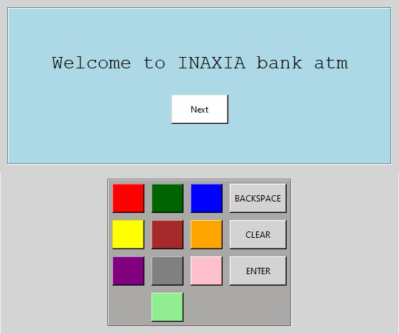
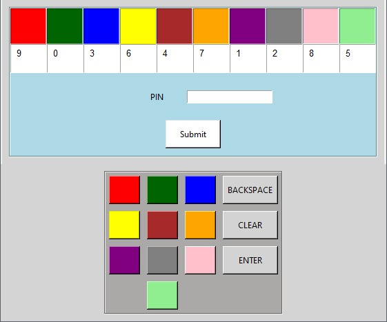
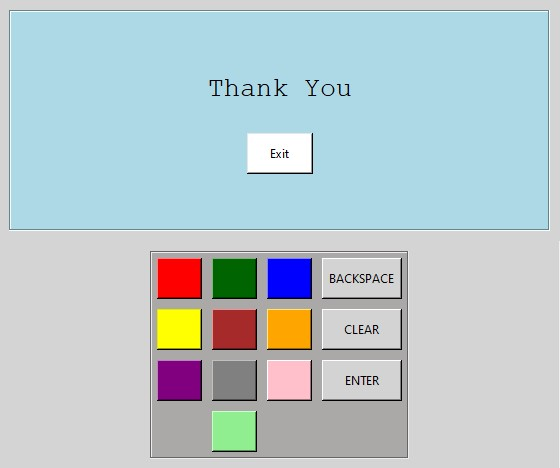

# Secure ATM
This project is made to make **Automated teller machine** more secure. It's simple nowadays to get your pin using hidden cameras, false keyboards, etc. So, here we are with a different idea to let your pin secure.

## Screenshots

| Welcome Page | ATM ID | PIN | Result |
|:---:|:---:|:---:|:---:|
|  |  |  |  |

## Demo

## Steps to Run
1. Fork this repo.
2. Clone your forked repo into your local system.
3. Install the `tkinter` library (usually comes pre-installed with Python, but you can install it if needed).
4. Run the code (`python code.py`).
5. And you are all done!

> **Note:** Ignore the errors and warnings, they won't bother you.

### Credentials for Demo
- **Correct ATM ID:** `2020`
- **Correct PIN:** `6344`
